# Отчет по лабораторной работе Работа с Git
Выполнил: Рыбаков Ярослав Валентинович 467289


# Ход выполнения работы

## Часть 1. Работа с Git через терминал

---

## 1. Инициализация репозитория

**Команды:**

```
git init   ls
ls -la   git status
```

**Что было сделано:**

Инициализирован новый локальный репозиторий командой `git init`.

Проверено содержимое текущей папки (`ls`, `ls -la`), включая скрытые файлы.

Через `git status` подтверждено, что репозиторий пуст: отслеживаемых файлов и коммитов нет.

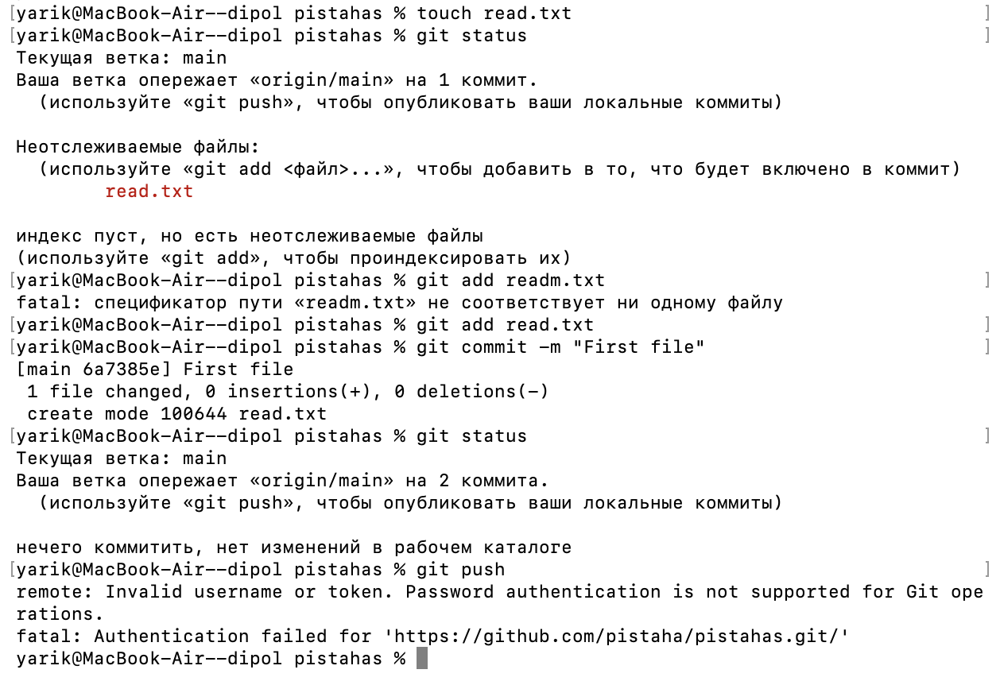

---

## 2. Создание и первый коммит

**Команды:**

```
touch readme.txt   nano readme.txt
git status   git add readme.txt
git status   git commit -m "First file"
git status
```

**Что было сделано:**

Создан файл `readme.txt`.

Файл заполнен текстом через редактор `nano`.

Проверено состояние репозитория (`git status`) — файл появился как неотслеживаемый.

Файл добавлен в индекс (`git add readme.txt`).

Создан первый коммит с сообщением `"First file"`.

После коммита репозиторий стал “чистым” (нет изменений для коммита).

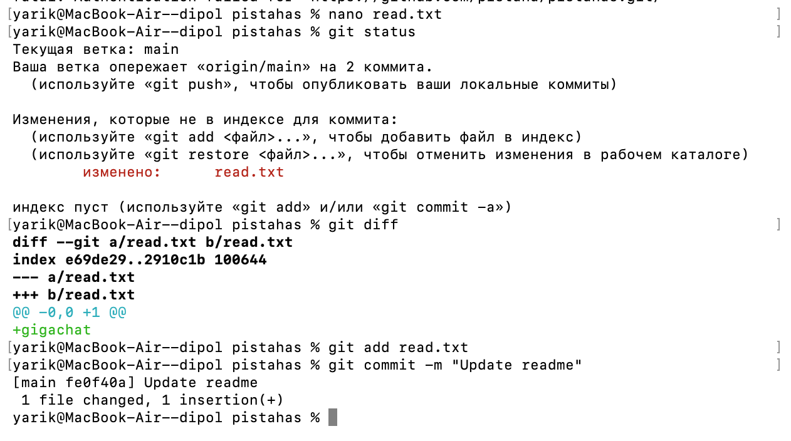

---

## 3. Изменение файла и подготовка к фиксации

**Команды:**

```
nano readme.txt    git status
git add readme.txt
```

**Что было сделано:**

В файл `readme.txt` добавлена строка.

Git определил изменения и показал файл как modified.

Изменения добавлены в staging area командой `git add readme.txt`.

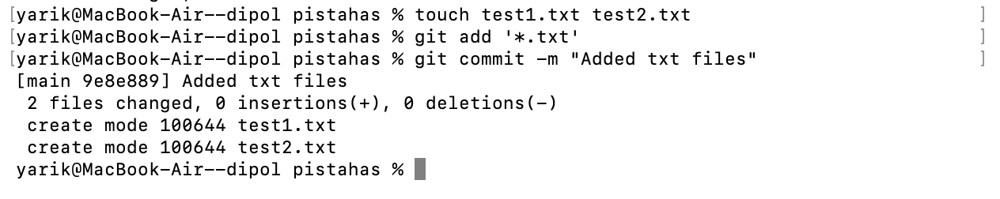

---

## 4. Создание дополнительных файлов и коммит через wildcard

**Созданы вручную файлы:**

* `readme after.txt`
* `readme now.txt`

**Команды:**

```
git status   git add '*.txt'
git status   git commit -m
```

**Что было сделано:**

Проверено состояние репозитория.

Все `.txt` файлы добавлены одной командой через шаблон `*.txt`.

Создан коммит.

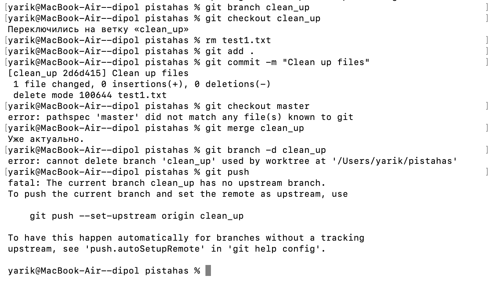

---

## 5. Просмотр истории коммитов

**Команды:**

```
git log   git log --summary
```

**Что было сделано:**

Просмотрена история коммитов.

Дополнительно выведена расширенная сводка (`--summary`) по изменениям в коммитах.

---

## 6. Подключение удалённого репозитория и первая отправка

**Команды:**

```
git remote add origin <>
git push -u origin main
```

**Что было сделано:**

Подключён удалённый репозиторий GitHub под именем `origin`.

Выполнена первая отправка коммитов в удалённую ветку (`main` / в видео использовалась `master`).

После push проверено, что файлы появились на GitHub.

---

## 7. Изменение файла через GitHub и синхронизация (pull + diff)

**Действие в браузере:**

Отредактирован `readme.txt`.

**Команды:**

```
git pull origin master
git diff HEAD
```

**Что было сделано:**

Получены изменения из удалённого репозитория командой `git pull`.

Через `git diff HEAD` просмотрены отличия рабочего состояния от последнего коммита.

---

## 8. Локальное изменение файла и проверка различий

**Действие:**

В `readme.txt` удалены восклицательные знаки.

**Команда:**

```
git diff HEAD
```

**Что было сделано:**

Изменения внесены локально.

Проверены различия относительно последнего коммита через `git diff HEAD`.

---

## 9. Работа с директорией и staged-изменениями

**Команды:**

```
mkdir folder
cd folder
touch bye.txt
git status
git add folder/bye.txt
cd ..
git status
git diff --staged
```

**Что было сделано:**

Создан каталог `folder`.

Внутри создан файл `bye.txt`.

Файл добавлен в индекс (`git add folder/bye.txt`).

Просмотрены изменения, подготовленные к коммиту (`git diff --staged`).

---

## 10. Отмена изменений

**Команды:**

```
git reset folder/bye.txt
git diff --staged
git diff
git checkout -- readme.txt
git status
cat readme.txt
```

**Что было сделано:**

Отменено добавление файла `bye.txt` в staging area.

Проверено, что staged-изменений больше нет.

Отменены правки в `readme.txt` и восстановлено состояние как в последнем коммите.

Командой `cat readme.txt` подтверждено итоговое содержимое файла.

---

## 11. Работа с ветками

**Команды:**

```
git branch clean_up
git branch
git checkout clean_up
git branch
ls
```

**Что было сделано:**

Создана новая ветка `clean_up`.

Выполнено переключение на неё.

Проверено, какая ветка активна.

---

## 12. Удаление файлов и коммит

**Команды:**

```
rm -r folder
git commit -m "Deleted folder and files"

git rm readme\ now.txt
git rm now\ now.txt
git status
git commit -m "Deleted folder and files"
```

**Что было сделано:**

Удалён каталог `folder`.

Удаление файлов выполнено через `git rm`.

Все удаления зафиксированы коммитом.

---

## 13. Слияние веток и отправка на GitHub

**Команды:**

```
git checkout main
git merge clean_up
git branch -d clean_up
git push
```

**Что было сделано:**

Выполнен возврат на ветку `main`.

Ветка `clean_up` слита в основную.

Временная ветка удалена.

Изменения отправлены в удалённый репозиторий.

---

## 14. Проверка результата

После выполнения `git push` открыта страница репозитория на GitHub и проверено, что:

* изменения применились
* удалённые файлы исчезли
* история коммитов обновилась

---

# Часть 2. Работа в GitHub Desktop

---

## 2.1 Открытие репозитория

Я открыл репозиторий `demo-repo` в программе **GitHub Desktop**.  
Активная ветка — `main`.

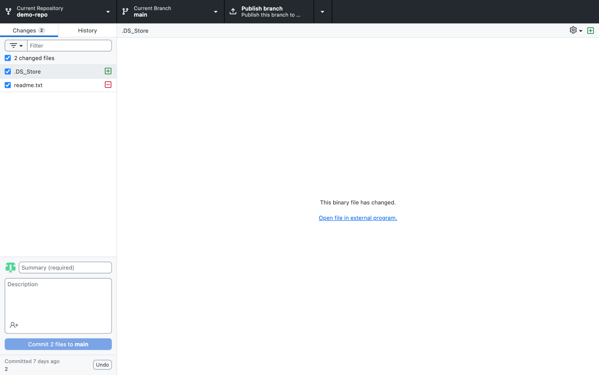

---

## 2.2 Создание и коммит нового файла

В папке репозитория был создан новый файл:

`1234.txt`

После изменения файла GitHub Desktop отобразил его во вкладке **Changes**.

Я ввёл сообщение коммита:

`Add 1234 and update files`

и нажал **Commit to main**.

После коммита появилась кнопка **Push origin**, и изменения были отправлены на GitHub.
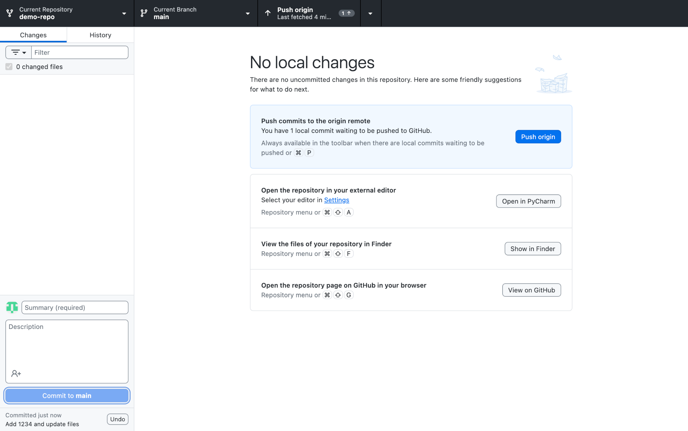
---

## 2.3 Изменение файла

Файл `1234.txt` был изменён.

GitHub Desktop отобразил изменения в виде diff (красные и зелёные строки).

Я ввёл сообщение:

`Update 1234.txt`

и нажал **Commit to main**, затем выполнил **Push origin**.

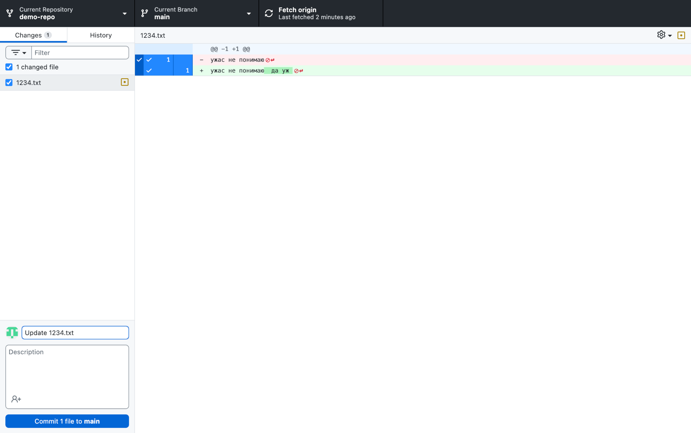

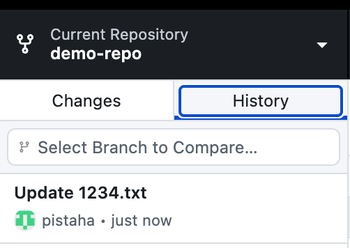
---

## 2.4 Создание папки и файла

В репозитории была создана папка:

`folder`

Внутри неё создан файл:

`файл папка.txt`

Изменения появились во вкладке **Changes**.

Я выполнил коммит с сообщением:

`Add folder and file`

После этого изменения были отправлены на удалённый репозиторий через **Push origin**.


---

## 2.5 Создание новой ветки

Через меню веток была создана новая ветка:

`new`

Ветка была создана на основе текущей ветки `main`.

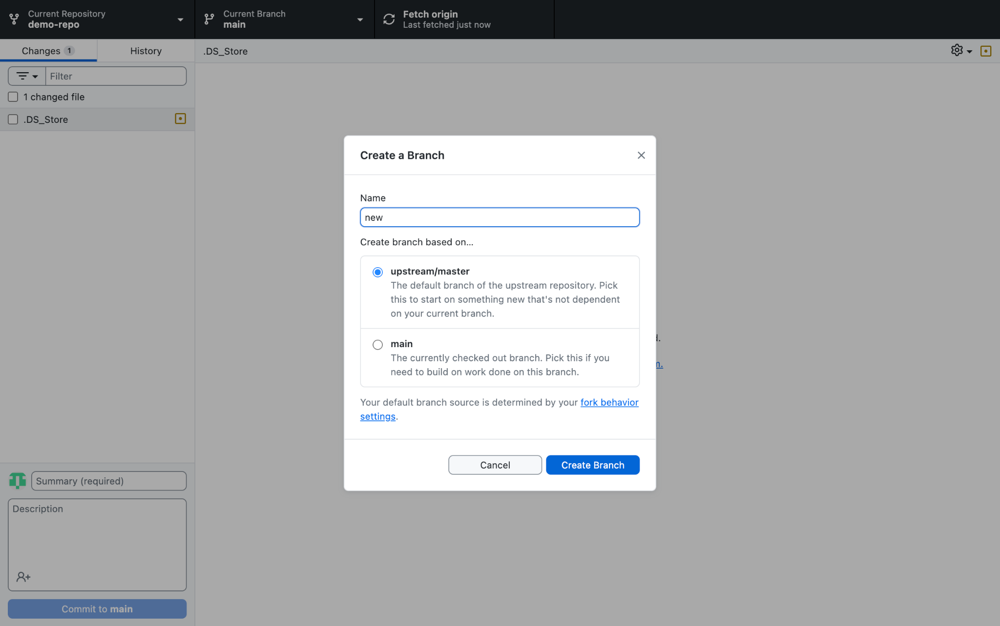

После создания произошло переключение на ветку `new`.
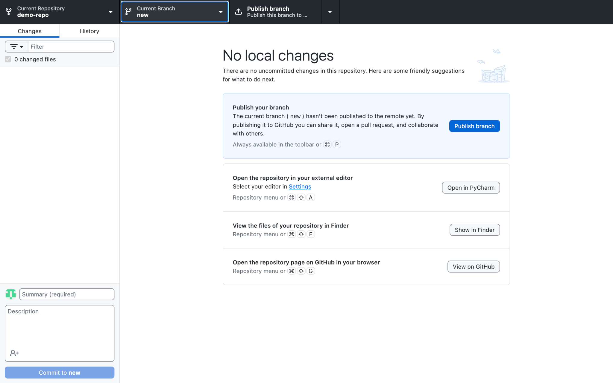

---

## 2.6 Работа в ветке new

В ветке `new` были внесены изменения:

- удалён файл `1234.txt`
    

GitHub Desktop отобразил удаление файла (пометка D).

Я выполнил коммит:

`Delete 1234.txt`

Затем нажал **Publish branch**, чтобы опубликовать ветку на GitHub.
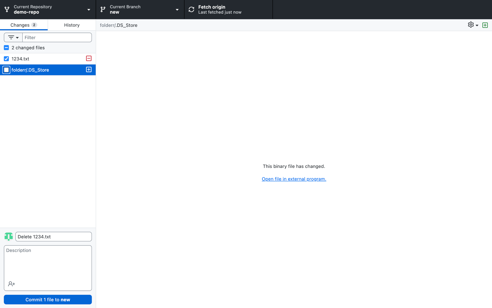

---

## 2.7 Слияние веток (Merge)

Я переключился обратно на ветку `main`.
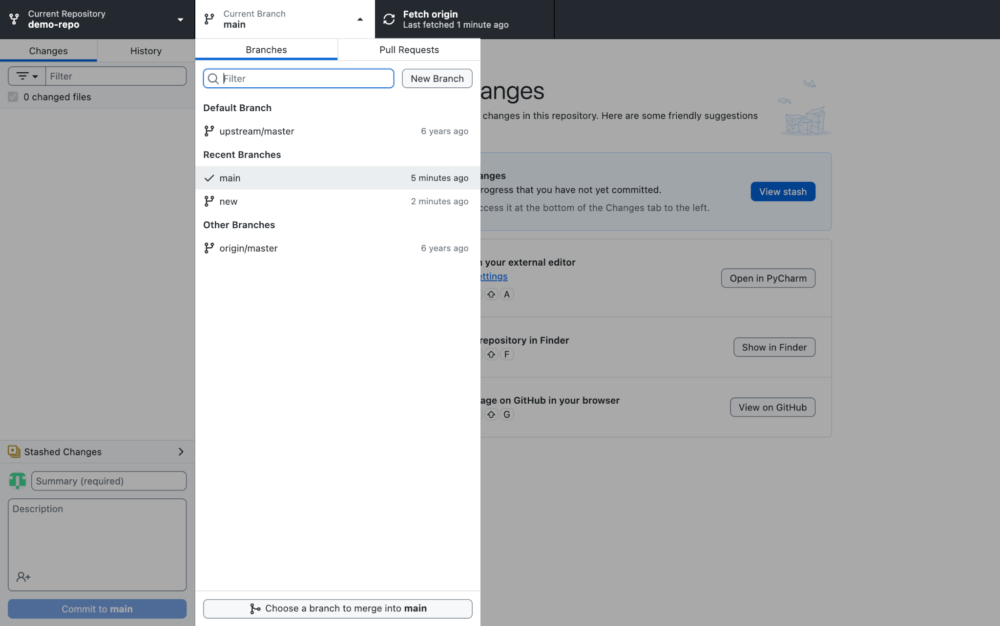

Через меню выбрал:

`Choose a branch to merge into main`

и выбрал ветку `new`.

GitHub Desktop показал сообщение:

`This will merge 1 commit from new into main`

Я нажал:

`Create a merge commit`

После этого выполнил **Push origin**.
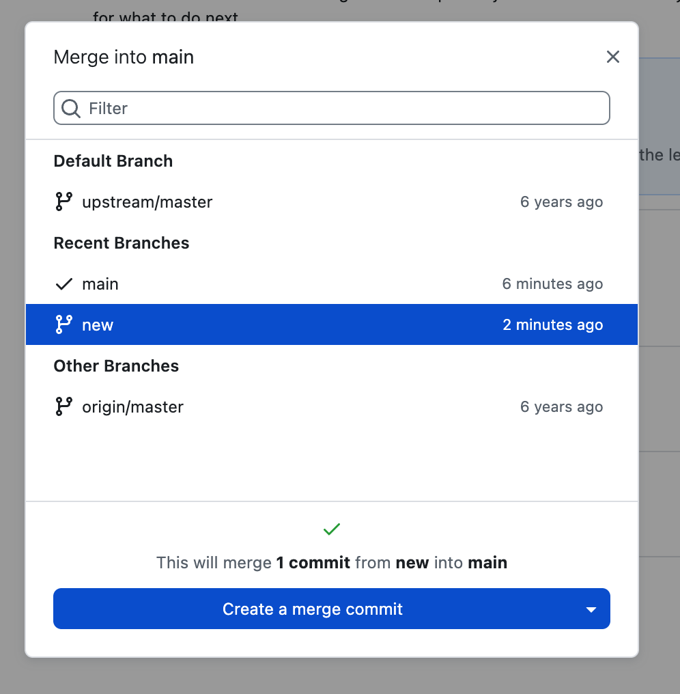

---

## 2.8 Удаление ветки

После успешного слияния ветка `new` стала не нужна.

Я удалил её:

- локально
    
- на удалённом репозитории (галочка «Yes, delete this branch on the remote»)
    


---

# Общий итог лабораторной работы

В ходе выполнения лабораторной работы были освоены основные принципы работы с системой контроля версий **Git** как через терминал, так и с использованием графического интерфейса **GitHub Desktop**.

## В части работы через терминал были изучены и отработаны:

* инициализация локального репозитория (`git init`)
* добавление файлов в индекс (`git add`)
* создание коммитов (`git commit`)
* просмотр истории изменений (`git log`, `git diff`)
* работа с несколькими файлами через шаблоны (`*.txt`)
* создание и удаление директорий
* отмена изменений (`git reset`, `git checkout`)
* создание, переключение и удаление веток (`git branch`, `git checkout`)
* слияние веток (`git merge`)
* подключение удалённого репозитория и отправка изменений (`git remote`, `git push`)
* синхронизация с удалённым репозиторием (`git pull`)

## В части работы с GitHub Desktop были освоены:

* создание и коммит файлов через графический интерфейс
* просмотр изменений в формате diff
* отправка изменений на GitHub (Push)
* создание и публикация веток
* слияние веток через интерфейс Merge
* удаление веток локально и на удалённом репозитории

---

## Вывод

В результате лабораторной работы были получены практические навыки работы с Git и GitHub в двух режимах:

1. Через командную строку — для более гибкого и полного управления репозиторием.
2. Через GitHub Desktop — для удобной визуальной работы с коммитами и ветками.

Все операции были успешно выполнены, изменения корректно отображаются в истории коммитов и синхронизированы с удалённым репозиторием GitHub.


