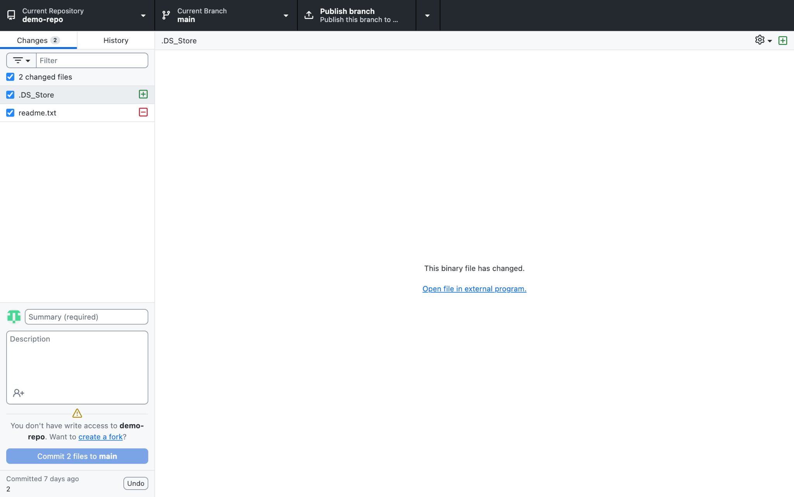

Часть 2. Работа в GitHub Desktop

---

## 2.1 Открытие репозитория

Я открыл репозиторий `demo-repo` в программе **GitHub Desktop**.  
Активная ветка — `main`.

---

## 2.2 Создание и коммит нового файла

В папке репозитория был создан новый файл:

`1234.txt`

После изменения файла GitHub Desktop отобразил его во вкладке **Changes**.

Я ввёл сообщение коммита:

`Add 1234 and update files`

и нажал **Commit to main**.

После коммита появилась кнопка **Push origin**, и изменения были отправлены на GitHub.
![[05e6194d-065e-4b34-88e6-ebab8f5fb418.png]]

---

## 2.3 Изменение файла

Файл `1234.txt` был изменён.

GitHub Desktop отобразил изменения в виде diff (красные и зелёные строки).

Я ввёл сообщение:

`Update 1234.txt`

и нажал **Commit to main**, затем выполнил **Push origin**.

![[f9db4d00-bdeb-4c20-90c7-f0ecdfe6af79.png]]

![[90718f57-2e7b-4bbf-84c7-8e2c44110dd6.png]]
---

## 2.4 Создание папки и файла

В репозитории была создана папка:

`folder`

Внутри неё создан файл:

`файл папка.txt`

Изменения появились во вкладке **Changes**.

Я выполнил коммит с сообщением:

`Add folder and file`

После этого изменения были отправлены на удалённый репозиторий через **Push origin**.

![[5987b899-8e5c-495b-a99a-995e555a3bc5.png]]

---

## 2.5 Создание новой ветки

Через меню веток была создана новая ветка:

`new`

Ветка была создана на основе текущей ветки `main`.

![[647044b2-694d-476d-833a-42e1c9239f08.png]]

После создания произошло переключение на ветку `new`.
![[024b30d6-646a-4b00-9615-6c7ed6f35b6d.png]]

---

## 2.6 Работа в ветке new

В ветке `new` были внесены изменения:

- удалён файл `1234.txt`
    

GitHub Desktop отобразил удаление файла (пометка D).

Я выполнил коммит:

`Delete 1234.txt`

Затем нажал **Publish branch**, чтобы опубликовать ветку на GitHub.
![[a0a20520-c705-4ed4-987f-a392f298e4d1.png]]

---

## 2.7 Слияние веток (Merge)

Я переключился обратно на ветку `main`.
![[d95a179a-e344-4825-9b35-c411f90b9f54.png]]

Через меню выбрал:

`Choose a branch to merge into main`

и выбрал ветку `new`.

GitHub Desktop показал сообщение:

`This will merge 1 commit from new into main`

Я нажал:

`Create a merge commit`

После этого выполнил **Push origin**.
![[332b9601-df40-4ce6-8060-1d3ae8817b60.png]]

---

## 2.8 Удаление ветки

После успешного слияния ветка `new` стала не нужна.

Я удалил её:

- локально
    
- на удалённом репозитории (галочка «Yes, delete this branch on the remote»)
    

---

## Итог работы

В ходе выполнения лабораторной работы с использованием GitHub Desktop я:

- создал и закоммитил файл `1234.txt`
    
- изменил файл и отправил изменения на GitHub
    
- создал папку `folder` и файл `файл папка.txt`
    
- создал новую ветку `new`
    
- внёс изменения в ветке `new`
    
- выполнил слияние ветки `new` с `main`
    
- удалил ветку `new` локально и на удалённом репозитории
    

Все изменения корректно отображаются в истории коммитов и синхронизированы с GitHub.
